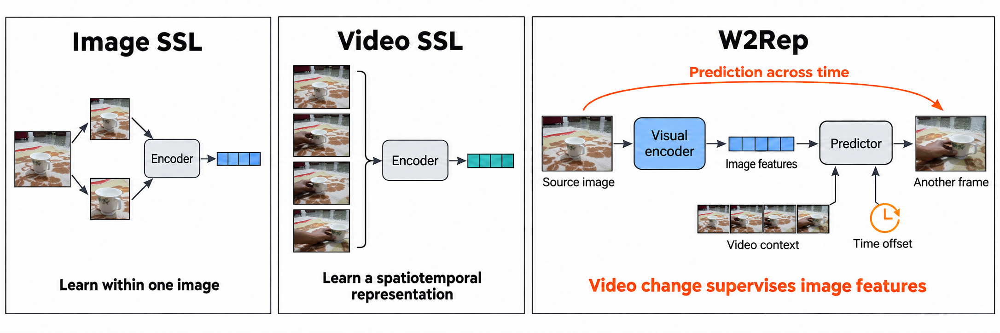
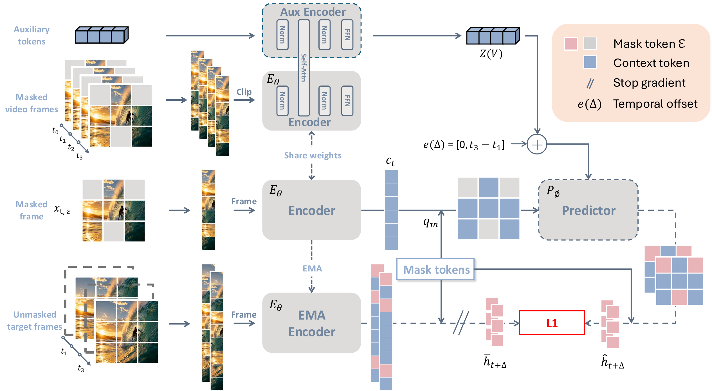

<div align="center">

<h1>W2Rep</h1>

<h3>Learning Visual Representations by Watching the World Change</h3>

<p>
  Wen Huang<sup>1,*</sup> &nbsp;
  Hang Guo<sup>1,*</sup> &nbsp;
  Jiarui Yang<sup>2</sup> &nbsp;
  Zheng Liu<sup>1</sup> &nbsp;
  Tao Dai<sup>3,†</sup> &nbsp;
  Shu-Tao Xia<sup>1</sup>
</p>

<p>
  <sup>1</sup>Tsinghua Shenzhen International Graduate School, Tsinghua University<br>
  <sup>2</sup>Nankai University &nbsp; <sup>3</sup>Shenzhen University<br>
  <sup>*</sup>Equal contribution &nbsp; <sup>†</sup>Corresponding author
</p>

**[Project page](https://wenooi.github.io/W2Rep/)** · **[Paper](https://arxiv.org/abs/2609.35464)**



</div>

W2Rep uses masked prediction within an image and across time to train one
visual encoder that remains useful for either image or video input. This
repository contains W2Rep pretraining and downstream evaluation code;
implementations of external comparison methods are intentionally not vendored.

| [](https://wenooi.github.io/W2Rep/) | [](https://wenooi.github.io/W2Rep/) |
|:---:|:---:|
| **Pushing a cup** | **Putting a ball into a cup** |
| [](https://wenooi.github.io/W2Rep/) | [](https://wenooi.github.io/W2Rep/) |
| **Pouring water** | **Opening a book** |

## What is the final method?

The default configuration matches the method used for the paper's main W2Rep
results:

- a ViT is applied to a masked video and to a sampled source image;
- 16 auxiliary clip latents summarize visible video context;
- one same-image and three cross-frame targets are predicted at masked spatial
  positions;
- the predictor receives the signed frame offset for cross-frame targets;
- all prediction terms use Smooth L1 and are averaged uniformly;
- the clip latents receive an `1e-4 * mean(z^2)` scale penalty;
- the target encoder is updated with an exponential moving average;
- only the EMA visual encoder is needed downstream.

The clip encoder uses ordinary bidirectional self-attention. Development-only
context-supervised ("full") and asymmetric-attention branches are not the
default method.

<p align="center">
  
</p>

## Layout

```text
configs/                 ViT-B/16 and ViT-L/16 pretraining configurations
scripts/                 launch examples without machine-specific paths
tools/                   data, checkpoint, and visualization utilities
w2rep/models/            self-contained encoder and predictor
w2rep/data/              video loading and spatial block masking
w2rep/eval/              frozen linear probes and video fine-tuning
w2rep/segmentation/      optional MMSegmentation adapter
train.py                 distributed pretraining entry point
```

The static project page lives in [`docs/`](docs/) and can be published directly
with GitHub Pages.

## Cross-frame feature visualization

The project page follows fixed source-image patches through several real
videos. Each target frame is encoded independently, and the displayed heatmap
is the cosine similarity between the fixed source feature and every
target-frame patch feature. The renderer uses every decoded frame at the
source frame rate and records the native feature grid, checkpoint hash, query
patch, and output hash in JSON:

```bash
python tools/visualize_smooth_patch_attention.py \
  --checkpoint /path/to/w2rep_checkpoint.pt \
  --video /path/to/example.webm \
  --output-dir outputs/patch_visualization
```

The same command also renders final-layer patch-to-patch attention averaged
over all query patches and heads. Neither visualization uses a class token or
auxiliary clip latent, and neither alters the learned checkpoint.

## Installation

```bash
python -m pip install -e '.[train]'
```

The core model is self-contained and does not import another research
repository. PyTorch, torchvision, OpenCV, Pillow, NumPy, and PyYAML are
sufficient for pretraining and classification evaluation. ADE20K additionally
requires MMSegmentation; see `w2rep/segmentation/README.md`. Datasets and
optional evaluation frameworks must be obtained separately under their
respective terms.

The retained encoder has one interface for images and videos:

```python
from w2rep.utils.checkpoint import load_encoder

encoder, metadata = load_encoder("/path/to/w2rep_checkpoint.pt")
image_features = encoder(images, with_z=False)["patch_out"]       # [B,1,N,D]
video_features = encoder(videos, with_z=False)["patch_out"]       # [B,T,N,D]
```

`images` has shape `[B,3,H,W]`; `videos` has shape `[B,T,3,H,W]`.
Inputs must already be normalized by the ImageNet mean and standard deviation.

## Data manifest

Pretraining expects one JSON file:

```json
{
  "train": [
    {"id": "video-0001", "path": "/data/videos/0001.webm", "label": 12}
  ],
  "val": []
}
```

`label` is not used by self-supervised pretraining and may be omitted. Paths
may be absolute or relative to `data.root`. Relative paths make a release
portable. `tools/build_ssv2_manifest.py` converts the official Something-
Something V2 metadata to this format.

## Pretraining

Edit only the `data.manifest`, `data.root`, and `output_dir` entries, then run:

```bash
torchrun --standalone --nproc_per_node=8 train.py \
  --config configs/pretrain/w2rep_vitb16.yaml
```

Resume from a full training checkpoint with:

```bash
torchrun --standalone --nproc_per_node=8 train.py \
  --config configs/pretrain/w2rep_vitb16.yaml \
  --resume outputs/w2rep_vitb16/checkpoint_0040000.pt
```

The resume path restores model, optimizer, schedules, EMA target, global step,
epoch, and random-number-generator states. Exact sample order additionally
assumes the same world size and data-loader configuration.

The controlled configurations under `configs/ablations/` inherit the complete
ViT-B/16 recipe and override only the named component. For example:

```bash
torchrun --standalone --nproc_per_node=8 train.py \
  --config configs/ablations/no_signed_offset.yaml
```

## Frozen evaluation

ImageNet uses a standard `ImageFolder` layout:

```bash
python -m w2rep.eval.linear_probe image \
  --checkpoint /path/to/w2rep_checkpoint.pt \
  --data-root /datasets/imagenet \
  --output-dir outputs/eval/imagenet
```

The default ImageNet preprocessing directly resizes each image to 224 x 224,
matching the paper evaluation. Pass `--spatial-preprocess center_crop` only for
a separately reported protocol.

Video datasets use CSV manifests with columns `path,label,split`. The same
entry point supports the two protocols used in the paper:

```bash
# Encode every sampled frame independently, then average.
python -m w2rep.eval.linear_probe video \
  --checkpoint /path/to/w2rep_checkpoint.pt \
  --manifest /data/ssv2.csv --encoding independent \
  --output-dir outputs/eval/ssv2_independent

# Encode all sampled frames jointly, then average space and time.
python -m w2rep.eval.linear_probe video \
  --checkpoint /path/to/w2rep_checkpoint.pt \
  --manifest /data/ssv2.csv --encoding joint \
  --output-dir outputs/eval/ssv2_joint
```

Frozen video evaluation defaults to 8 frames uniformly sampled over the full
video and direct 224 x 224 resizing. These choices differ intentionally from
the stride-3 temporal window and random crop used for pretraining.

Feature caches store a checkpoint fingerprint and evaluation settings. The
evaluator refuses to reuse a cache whose identity does not match.

See `EVALUATION.md` for the exact probe and full fine-tuning recipes.

## Fine-tuning and segmentation

`python -m w2rep.eval.finetune_video --help` exposes the SSv2-style full
fine-tuning protocol. The loader accepts the same generic video CSV, so it can
also be used for UCF101 or Diving48 after preparing their official splits.

For ADE20K, the release provides an MMSegmentation backbone adapter and a
UPerNet configuration template under `w2rep/segmentation/`. MMSegmentation is
kept optional because its version constraints are independent of pretraining.

## Checkpoint convention

Training checkpoints contain `encoder`, `target`, and `predictor` state dicts.
Evaluation loads `target` by default. Paper-development checkpoints remain
supported; the release model preserves their parameter names and tensor
shapes.

To create a smaller encoder-only checkpoint that omits optimizer and predictor
state, run:

```bash
python tools/export_encoder_checkpoint.py \
  --input outputs/w2rep_vitb16/ckpt_final.pt \
  --output outputs/w2rep_vitb16_encoder.pt
```

The command records the source checkpoint hash and prints the exported file's
SHA-256. Both full and encoder-only checkpoints use the same evaluation CLI.

## Reproducibility notes

- The default clip contains 8 frames sampled with stride 3.
- One spatial mask is shared by all frames in a clip.
- The final method supervises masked positions only. `mask_weight` and
  `ctx_weight` from historical context-supervised configs are not used.
- External baselines retain their own objectives and repositories; they should
  not be inferred from this codebase.

## Citation

```bibtex
@article{huang2026w2rep,
  title         = {W2Rep: Learning Visual Representations by Watching the World Change},
  author        = {Huang, Wen and Guo, Hang and Yang, Jiarui and Liu, Zheng and Dai, Tao and Xia, Shu-Tao},
  year          = {2026},
  eprint        = {2609.35464},
  archivePrefix = {arXiv},
  primaryClass  = {cs.CV},
  url           = {https://arxiv.org/abs/2609.35464}
}
```

## License

The source code is released under the
[Apache License 2.0](LICENSE). Pretrained model weights are not included in
this release.
